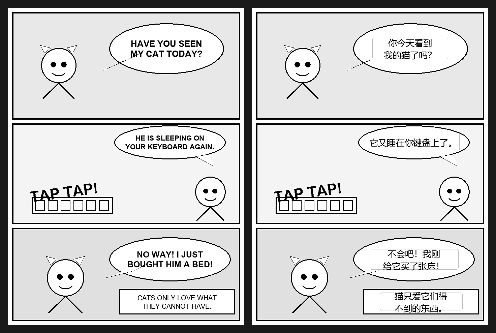
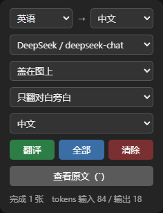

# Manga-Overlay-Translator

网页漫画 OCR 翻译器。它通过 Tampermonkey 脚本抓取漫画页面图片，把图片发送到本地 Python 服务，使用 PaddleOCR 识别文字位置和内容，再调用 OpenAI 兼容的 LLM 接口翻译，并把译文覆盖回原图对应位置。

适合阅读日文、韩文、英文、西文漫画页面时做即时辅助翻译。当前效果定位是“可读辅助翻译”，不是自动官方汉化。

> 默认只监听 `127.0.0.1`，API Key 只保存在本地服务的 `server/.env`，不会写入用户脚本或网页上下文。

## 效果预览

**翻译前 / 翻译后对比**（左：英文原页；右：真实翻译管线输出的覆盖效果）：



对比图素材取自 Winsor McCay 的《Little Nemo in Slumberland》（1906 年，
**公有领域**，来源 Wikimedia Commons）。右侧覆盖层使用后端真实返回的坐标与
译文生成，未做人工修饰——所见即产品实际效果，包括手写体 OCR 的识别误差由
LLM 按语境纠正后的结果。

### 控制面板



从上到下依次选择：源语言与目标语言、LLM 模型、显示方式、翻译范围和界面语言。面板会显示已处理图片数量及本轮 token 消耗。

## 5 分钟上手

1. 克隆项目并安装后端：

   ```powershell
   git clone https://github.com/Yuff1010/Manga-Overlay-Translator.git
   cd Manga-Overlay-Translator\server
   python -m venv .venv
   .\.venv\Scripts\Activate.ps1
   python -m pip install --upgrade pip
   python -m pip install -r requirements.txt
   copy .env.example .env
   ```

   macOS / Linux 请把激活命令换成 `source .venv/bin/activate`，复制配置换成 `cp .env.example .env`。

2. 编辑 `server/.env`，至少填写 `LLM_BASE_URL`、`LLM_API_KEY` 和 `LLM_MODEL`。
3. 在 `server/` 目录启动服务：

   ```powershell
   python main.py
   ```

   浏览器打开 `http://127.0.0.1:8765/ping`，看到 `{"ok": true}` 即表示后端可用。

4. 安装 Tampermonkey，新建脚本，把 [`userscript/ocr-translator.user.js`](userscript/ocr-translator.user.js) 的内容完整粘贴进去并保存。
5. 打开你有权访问的漫画页面，从 Tampermonkey 菜单选择“打开翻译面板”，设置语言和模型后点“翻译”或“全部”。

后文包含完整安装说明、面板操作、API 字段、GPU 与气泡增强配置。


## 功能

- 支持网页中的 ``、`<canvas>`、CSS 背景图、懒加载图片。
- 支持 shadow DOM 和同源 iframe 中的图片扫描。
- 支持按需翻译：滚动到哪里翻译到哪里。
- 支持整页翻译：一次处理当前页面可扫描到的全部漫画图。
- 支持源语言选择：自动检测、日语、韩语、英语、西语、中文。
- 支持目标语言选择：中文、英文、日文、韩文。
- 支持在面板上切换 LLM 供应商和模型，也可手填模型名。
- 面板显示本轮累计消耗的输入 / 输出 token。
- 按图片原始坐标返回 OCR 文本框，前端按页面缩放比例定位覆盖层。
- 支持两种显示方式：译文盖在图片原文位置并逐帧跟随，或作为普通文字插在图片下方。
- 支持“只翻对白旁白 / 翻译全部文字”即时切换，无需重新 OCR 或翻译。
- 面板界面支持中文、英文、日文、韩文、西班牙文，首次使用跟随浏览器语言。
- 译文块支持悬停查看原文，点击临时隐藏译文查看原图。
- 对超长条漫自动切片，避免 PaddleOCR 缩放后丢字。
- 后端维护 OCR 实例池，支持多个前端请求并发处理。

## 项目结构

```text
Manga-Overlay-Translator/
├─ README.md
├─ docs/images/                   # README 原创演示图
├─ server/
│  ├─ main.py                     # FastAPI 服务入口
│  ├─ ocr.py                      # OCR、切片与文本块合并
│  ├─ translator.py               # LLM 翻译与对白分类
│  ├─ bubble.py                   # 可选气泡分割增强
│  ├─ requirements.txt            # 核心依赖
│  ├─ requirements-bubble.txt     # 可选气泡增强依赖
│  └─ .env.example                # 环境变量模板
└─ userscript/
   └─ ocr-translator.user.js
```

## 工作原理

```text
网页漫画图片
    │
    │ Tampermonkey 脚本扫描、抓图、转 data URL
    ▼
本地服务 http://127.0.0.1:8765
    │
    ├─ PaddleOCR：识别文本和坐标
    ├─ LLM API：批量翻译 OCR 文本
    └─ 返回图片尺寸、文本框、原文、译文及对白标记
    │
    ▼
浏览器覆盖层按图片缩放比例定位译文
```

## 环境要求

- Windows、macOS 或 Linux。
- Python 3.9 到 3.12。
- 浏览器安装 Tampermonkey 或兼容用户脚本管理器。
- 一个 OpenAI 兼容 Chat Completions 接口，例如 DeepSeek、OpenAI 或中转服务。
- 首次使用 PaddleOCR 时需要下载 OCR 模型。

## 后端安装

进入项目根目录后执行：

```bash
cd server
python -m venv .venv
```

Windows PowerShell：

```powershell
.\.venv\Scripts\Activate.ps1
python -m pip install --upgrade pip
python -m pip install -r requirements.txt
copy .env.example .env
```

macOS / Linux：

```bash
source .venv/bin/activate
python -m pip install --upgrade pip
python -m pip install -r requirements.txt
cp .env.example .env
```

编辑 `server/.env`：

```env
LLM_NAME=DeepSeek
LLM_BASE_URL=https://api.deepseek.com/v1
LLM_API_KEY=sk-xxxx
LLM_MODEL=deepseek-chat
LLM_MODELS=deepseek-chat,deepseek-reasoner   # 可选，面板下拉里列出的模型
```

想在面板上切换多个供应商，就再加几组，后缀从 2 开始递增：

```env
LLM_2_NAME=OpenAI
LLM_2_BASE_URL=https://api.openai.com/v1
LLM_2_API_KEY=sk-yyyy
LLM_2_MODELS=gpt-4o-mini,gpt-4o
```

API Key 只保存在服务端。用户脚本以 `@match *://*/*` 注入所有页面，
密钥若存进浏览器存储，脚本在任意网页上都能读到它，因此面板只在服务端
预先配好的若干组之间切换，不接受填写密钥。

启动服务：

```bash
python main.py
```

服务启动后访问：

```text
http://127.0.0.1:8765/ping
```

返回 `{"ok": true}` 即代表服务可用。

## 用户脚本安装

先安装 [Tampermonkey](https://www.tampermonkey.net/)，然后任选一种方式。

**方式一：从 Greasy Fork 安装（推荐，可自动更新）**

<!-- 发布到 Greasy Fork 后，把下面的链接换成实际地址 -->
前往脚本页面点击安装即可。以后脚本有更新时 Tampermonkey 会自动提示。

**方式二：手动粘贴**

1. 打开 Tampermonkey 管理面板 → 新建脚本
2. 复制 [`userscript/ocr-translator.user.js`](userscript/ocr-translator.user.js) 的全部内容，粘贴保存

手动安装不会自动更新，仓库里的脚本更新后需要重新粘贴一次。

装好后确认本地后端服务已启动，再打开漫画页面使用。

## 使用方法

1. 打开一个你有权访问的漫画阅读页面。
2. 点击浏览器里的 Tampermonkey 图标，选择 `漫画图片翻译 (OCRTranslator)` → `🈯 打开翻译面板`。
3. 选择源语言和目标语言；不确定源语言时可用“自动检测”，本轮后续图片会复用第一次检测结果。
4. 选择服务端已配置的 LLM 供应商和模型。这里不会要求输入 API Key；自定义模型只会替换模型名。
5. 选择翻译范围：
   - `只翻对白旁白`：默认选项，隐藏音效、拟声词、水印、页码和 OCR 噪声。
   - `翻译全部文字`：显示后端返回的所有文本块。切换范围不会重新请求后端。
6. 开始处理：
   - `▶ 翻译`：按需模式，滚动到图片附近时才开始处理。
   - `⚡ 全部`：立即处理当前页面所有候选漫画图片。
   - `✖`：清除当前页面译文并重置状态。
7. 选择显示方式：
   - `🖼 盖在图上`：译文覆盖在原文位置并逐帧跟随图片移动。
   - `📄 图下方列出`：译文作为普通文字插在图片下方，可选择复制；气泡太窄时更易读。
8. 查看结果：
   - 悬停译文块可查看 OCR 原文。
   - 点击译文块可临时隐藏 2 秒。
   - 按反引号键 `` ` `` 可整体显示或隐藏译文。
   - 面板状态行会显示处理进度、失败原因和本轮 token 用量。

显示方式、翻译范围和显隐状态的切换都不会重新 OCR 或翻译。

## API

### `GET /ping`

健康检查。

响应：

```json
{
  "ok": true
}
```

### `POST /translate`

请求：

```json
{
  "image": "data:image/jpeg;base64,...",
  "lang": "japan",
  "target": "中文",
  "profile": "1",
  "model": "deepseek-chat"
}
```

字段说明：

- `image`：base64 图片，可以包含 `data:image/...;base64,` 前缀。
- `lang`：PaddleOCR 语言代码，可选 `auto`、`japan`、`korean`、`en`、`es`、`ch`。
- `target`：目标语言文案，例如 `中文`、`英文`、`日文`、`韩文`。
- `profile`：可选，LLM 供应商编号。留空使用 `.env` 里的第一组。
- `model`：可选，模型名。留空使用该供应商的默认模型。

响应：

```json
{
  "width": 764,
  "height": 1200,
  "lang": "japan",
  "translated": true,
  "error": "",
  "usage": {
    "prompt_tokens": 80,
    "completion_tokens": 6
  },
  "blocks": [
    {
      "x": 33,
      "y": 57,
      "w": 142,
      "h": 103,
      "text": "第3",
      "translation": "第三",
      "dialogue": true
    }
  ]
}
```

`usage` 统计的是这一张图消耗的 token，失败重试的消耗也计入其中。
`dialogue` 表示该块是否为对白或旁白正文，用户脚本用它即时切换翻译范围。
`translated=false` 时仍会返回 OCR 块；`error` 给出翻译失败原因，前端以淡黄色显示回退原文。
气泡模型、LLM 或可选增强失败都不应丢失已经取得的 OCR 结果。

### `GET /config`

返回可用的 LLM 供应商与模型，供用户脚本填充下拉框。响应不包含 API Key。

```json
{
  "profiles": [
    { "id": "1", "name": "DeepSeek", "models": ["deepseek-chat", "deepseek-reasoner"] }
  ],
  "default": { "profile": "1", "model": "deepseek-chat" }
}
```

## 真实页面测试记录

已用官方合法页面测试核心链路：

- 测试站点：少年ジャンプ＋
- 测试页面：`https://shonenjumpplus.com/episode/13932016480029012546`
- 图片来源：页面内真实漫画图片 CDN。
- 单页尺寸：`764 x 1200`
- 后端状态：`GET /ping` 返回 `{"ok": true}`
- 翻译接口：`POST /translate` 返回 HTTP 200。
- 连续测试 4 张图片，分别识别到 `4 / 12 / 8 / 12` 个文本块。
- 返回结果中 `translated` 为 `true`，说明 OCR 和 LLM 翻译链路都走通。

测试结论：项目可以处理真实网页漫画图。日文竖排对白可识别和翻译，但 OCR 结果会混入少量假名标注、噪声字符或拆行文本，LLM 能纠正一部分。当前结果适合辅助阅读，不适合直接作为精修嵌字稿。

## 可选：气泡分割增强

区分「对白」和「画面文字」时，除了让 LLM 判断，还可以用气泡分割模型作为
**几何软信号**：落在对话气泡内的文本强制保留，气泡外的（旁白、音效、水印）
仍交给 LLM 判定。这样气泡内的对白即使 LLM 误判也不会被吞掉，同时不会误杀
天然在气泡外的旁白。

**这是可选增强**，不装也能正常工作（退回纯 LLM 判断）。启用需要两步：

```bash
python -m pip install -r server/requirements-bubble.txt
```

从 [kitsumed/yolov8m_seg-speech-bubble](https://huggingface.co/kitsumed/yolov8m_seg-speech-bubble) 下载 `model_dynamic.onnx`（约 104 MB），重命名为 `bubble.onnx` 并放到 `server/models/`。模型文件不会提交到 Git。

重启后端，日志出现 `[bubble] 气泡增强已启用` 即生效。

> 说明：气泡增强对**分页漫画**（日漫单页，气泡密集）最有效，单页开销约 0.2s。
> **超长条漫默认跳过**——条漫对白多是无框旁白，气泡稀少，而 CPU 上滑窗检测
> 每张要几秒，不划算。想在条漫上也启用，装 GPU 版 onnxruntime 后调大环境
> 变量 `BUBBLE_MAX_TILES`。

## GPU 加速

CPU 可以运行，但 OCR 是主要耗时。NVIDIA 显卡用户可以安装 PaddlePaddle GPU 版本。

示例，CUDA 11.8：

```bash
pip uninstall paddlepaddle -y
pip install paddlepaddle-gpu==3.2.2 -i https://www.paddlepaddle.org.cn/packages/stable/cu118/
python -c "import paddle; paddle.utils.run_check()"
```

如果输出显示 Paddle 正常检测到 GPU，即可使用 GPU 推理。

## 关键实现细节

### 长图切片

条漫常见尺寸可能是 `760 x 15000`。如果整张图直接送入 PaddleOCR，检测器会把最长边缩到约 `960px`，文字会变得非常小，导致漏检。

`server/ocr.py` 会根据图片宽度计算切片高度，让每个切片以接近原始分辨率进入 OCR，再把切片内坐标还原到原图坐标。

### 文本框合并

PaddleOCR 返回的是文本行。漫画对白经常是多行或竖排，所以后端会把空间上接近的文本行合并成一个文本块，再交给 LLM 批量翻译。

### 翻译失败兜底

如果没有配置 `LLM_API_KEY`，或某批 LLM 调用失败，后端不会中断整个请求，而是返回原文。前端会用淡黄色覆盖层提示这张图没有真正翻译成功。

### 自动语言检测

`auto` 模式会在几个候选 OCR 模型之间试跑，并按文字脚本类型打分。检测到的源语言会返回给前端，后续图片复用该语言，避免每张图重复检测。

## 常见问题

### `pip install -r requirements.txt` 在 Windows 上乱码或报 UnicodeDecodeError

`requirements.txt` 已包含 UTF-8 编码声明。若仍遇到编码问题，可以临时设置：

```powershell
$env:PYTHONUTF8='1'
python -m pip install -r requirements.txt
```

### 前端提示无法连接本地服务

确认后端正在运行：

```bash
cd server
python main.py
```

再访问：

```text
http://127.0.0.1:8765/ping
```

### 页面图片没有被翻译

可能原因：

- 图片尺寸小于脚本阈值，被判断为图标、头像或广告。
- 图片位于跨域 iframe，脚本不能访问 iframe 内 DOM。
- 页面使用受保护 canvas，浏览器禁止 `toDataURL()` 读取像素。
- 图片 CDN 返回 HTML、防盗链页面或空响应。
- 站点懒加载还没把真实图片 URL 写入 DOM。

### 返回译文和原文一样

常见原因：

- `server/.env` 没有配置 `LLM_API_KEY`。
- LLM 接口地址或模型名错误。
- LLM 请求超时或限流。

后端会在这种情况下返回原文，并把响应字段 `translated` 设为 `false`。

### OCR 识别不准

常见原因：

- 字体太小。
- 文字是变形拟声词或嵌入纹理。
- 气泡文字被画面遮挡。
- 源语言选择错误。
- 韩语 OCR 相比日语、英语更不稳定。

## 已知限制

- 拟声词、美术字、纹理字识别效果有限。
- 混合语言页面一次只能选择一个主要 OCR 语言。
- 部分 canvas 站点因浏览器安全策略无法读取像素。
- 当前是覆盖层翻译，不会真正修复原图或擦除原文。
- 翻译质量依赖 OCR 质量和所配置的 LLM 模型。
- 站点结构变动可能导致 userscript 需要调整扫描规则。

## 安全与隐私

- 不要提交 `server/.env`，其中包含 API Key。
- 图片会发送到本地服务，再由本地服务把 OCR 文本发送到配置的 LLM API。
- 默认服务只监听 `127.0.0.1:8765`。
- Tampermonkey 脚本带有 `@match *://*/*`，使用时请只在需要翻译的漫画页面打开面板。

## 开发检查

检查 Python 源码语法：

```bash
python -c "import ast, pathlib; [ast.parse(pathlib.Path(f).read_text(encoding='utf-8'), filename=f) for f in ['server/main.py','server/ocr.py','server/translator.py','server/bubble.py']]; print('python syntax ok')"
```

检查用户脚本语法：

```bash
node --check userscript/ocr-translator.user.js
```

依赖清单校验：

```bash
python -m pip install -r server/requirements.txt
```

## 设计参考

README 的“效果展示 → 快速安装 → 完整用法 → 高级配置”组织方式参考了 [zyddnys/manga-image-translator](https://github.com/zyddnys/manga-image-translator)。本项目不是该仓库的复刻：这里采用 Tampermonkey + 本地 FastAPI 服务，把译文实时覆盖在合法访问的网页图片上；没有复制对方的代码、模型或示例漫画图片。

## 许可与内容来源

请只在你有权访问的漫画页面上使用本工具。测试和开发建议优先使用官方、合法、公开可读的漫画页面。项目不包含任何漫画图片、扫描件或第三方版权内容；`docs/images/` 中的演示图为本项目原创生成。
